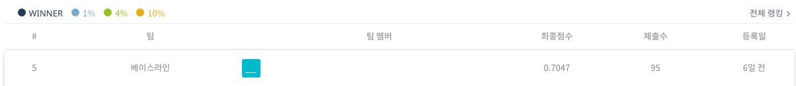

## 제1회 코스포 x 데이콘 자동차 충돌 분석 AI경진대회(채용 연계형)

**private 5등 솔루션**



## 실행

`crash`, `ego`, `weather`, `timing` 총 4개 변수에 대한 각각을 예측하는 모형을 생성.

각각의 변수를 학습하기 위한 예시는 아래와 같습니다.

다음은 `crash`를 예측하기 위한 실행 명령어 예시입니다.


> Conv3D 베이스 모델(x3d_m)

```bash
python main.py --epoch 20 --bs 4 --lr 5e-5 --height 112 --width 112 --name cnn --seed 0 --fs 3 --gamma 2 --wandb 1 --model x3d_m --es 5 --kfold 1 --rs 1 --cuda 0 --target crash
```


> ResNet18 + rnn 베이스 모델

```bash
python main.py --epoch 20 --bs 4 --lr 5e-5 --height 112 --width 112 --name rnn --seed 0 --fs 3 --gamma 2 --wandb 1 --model rnn --es 5 --kfold 1 --rs 1 --cuda 0 --target crash
```

**arguments**
- height: 이미지 크기
- fs: 프레임 스킵
- gamma: Focal Loss 에 적용되는 감마 값
- wandb: 1: 적용, 0: 미적용
- model: 모델의 이름
- es: 얼리스탑 적용 여부
- kfold: KFold 적용 여부
- rs: 랜덤 시드 변경 여부
- cuda: CUDA 디바이스 (0, 1)
- target: crash, ego, weather, timing 중 선택
